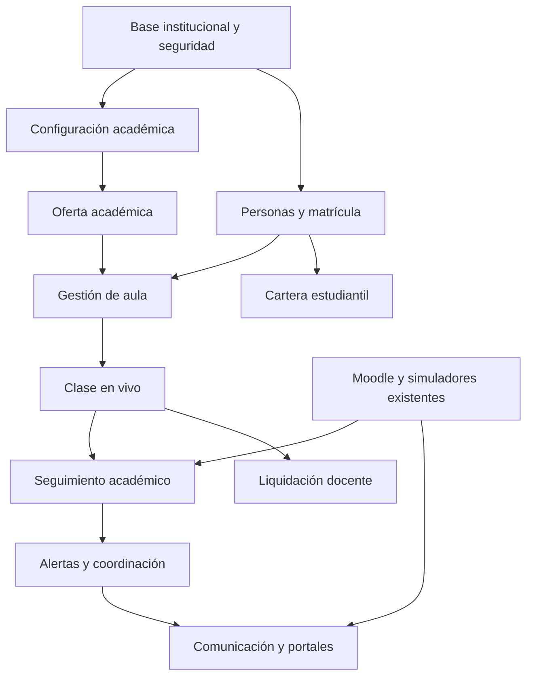
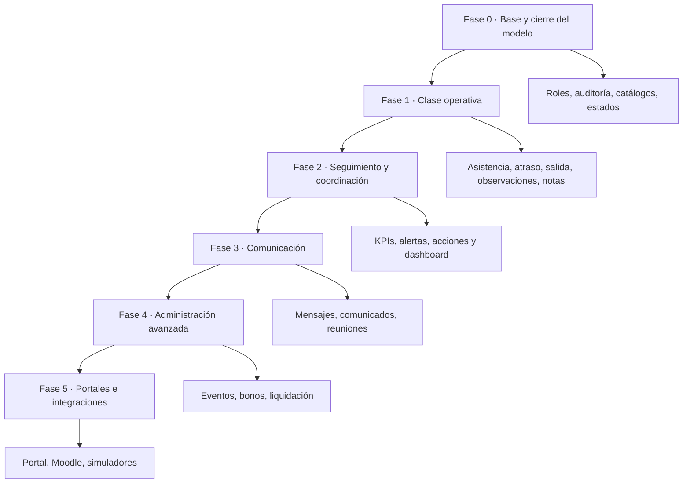
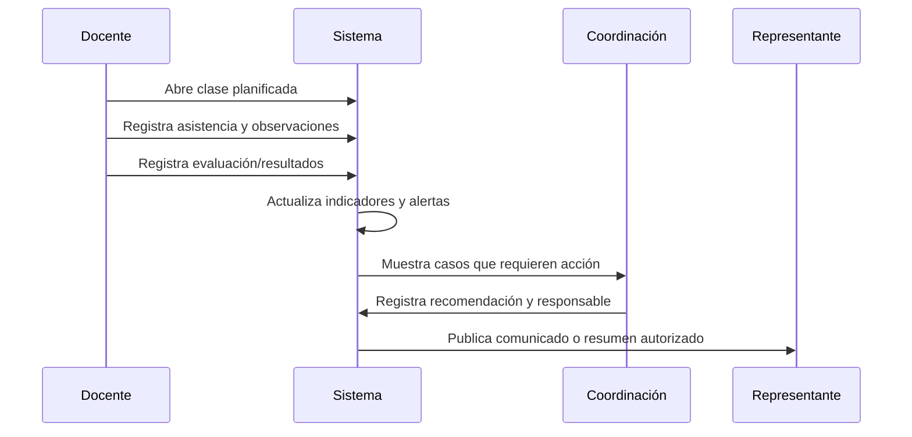

# Plan maestro de implementación — Sistema de Gestión Preuniversitario

**Propósito:** ordenar la programación en entregas funcionales. Moodle y simuladores ya existen: Django los integra, no los reconstruye.

## 1. Arquitectura funcional y dependencias

| Bloque | Entrega | Depende de |
|---|---|---|
| Fundaciones | multiinstitución, roles, permisos, auditoría, borrado lógico | — |
| Académico | período, curso, grupo, aula, horario, asignatura, docente | Fundaciones |
| Estudiantes | ficha, representante, matrícula, historial de cambios | Fundaciones + Académico |
| Operación docente | planificación, revisión, recursos, lista de clase | Académico + Estudiantes |
| Indicadores | asistencia, notas, observaciones, alertas, seguimiento | Operación docente |
| Relación institucional | mensajes, comunicados, reuniones, eventos | Indicadores + roles |
| Finanzas ampliadas | cartera existente, liquidación docente | Operación docente + eventos |
| Integraciones | Moodle, simuladores, portales | Indicadores + roles |

## 2. Backlog por fases

### Fase 0 — Preparación transversal

- Definir estados homologados, permisos por módulo/acción y `creado_por`.
- Completar historial para matrícula, grupo, aula, horario y período, con motivo y fecha.
- Catálogos: procedencia, tipo de observación, tipo de salida, recesos, tipos de evaluación.
- Criterio de terminado: ningún registro sensible se elimina físicamente; toda modificación relevante queda auditada.

### Fase 1 — Flujo académico mínimo viable

1. Lista de clase por horario/grupo/materia/docente.
2. Asistencia: presente, falta, atraso, salida anticipada, justificación y observación.
3. Observación con visibilidad: historial, Coordinación, Dirección o ambos.
4. Registro de evaluaciones y resultados visibles por estudiante.
5. Criterio de terminado: el docente puede ejecutar una clase completa sin usar Excel.

### Fase 2 — Seguimiento y Coordinación

1. Consolidado de asistencia, promedios y tendencias por estudiante, asignatura y grupo.
2. Semáforo configurable: bajo rendimiento, inasistencia y cartera pendiente.
3. Ficha de seguimiento: recomendación, responsable, fecha límite, estado y evidencia.
4. Dashboard de Coordinación: pendientes de revisión, estudiantes en alerta y acciones vencidas.
5. Criterio de terminado: Coordinación identifica y asigna acciones desde un único panel.

### Fase 3 — Comunicación institucional

1. Conversaciones por destinatario y contexto (estudiante, grupo, matrícula o seguimiento).
2. Estados enviado, recibido y leído; adjuntos y auditoría.
3. Comunicados y convocatorias con confirmación de lectura.
4. Buzón de sugerencias anónimo o identificado.
5. Reuniones: agenda, acuerdos, responsable, fecha, seguimiento y acta.

### Fase 4 — Administración avanzada

1. Eventos: tablero, checklist, responsables, evidencias, indicadores y aprobación.
2. Bonos por evento con reglas transparentes y trazabilidad.
3. Liquidación docente mensual: horas normales, extras, eventos, bonos, descuentos y autorización.
4. Reportes formales y documentos PDF/ODT.

### Fase 5 — Portales e integraciones

1. Portal estudiante: horario, asistencia, notas, recursos, cartera y resultados.
2. Portal representante: resumen, alertas, pagos, comunicaciones y confirmaciones.
3. Moodle: enlace SSO/permisos o sincronización definida; no duplicar contenidos.
4. Simuladores: importación de resultados y visualización en seguimiento.

## 3. Flujo operativo objetivo

## 4. Mapa de roles

| Rol | Opera | Consulta / aprueba |
|---|---|---|
| Administrador | institución, usuarios, permisos, catálogos | auditoría y configuración global |
| Dirección | comunicados, reuniones, eventos, decisiones | indicadores, casos, liquidaciones |
| Coordinación | horarios, revisión, seguimiento, alertas | planificación, asistencia, notas |
| Docente | planificación, recursos, clase, asistencia, notas | grupos y estudiantes asignados |
| Estudiante | portal propio | horario, recursos, resultados, cartera autorizada |
| Representante | comunicaciones y confirmaciones | progreso, asistencia, pagos y alertas autorizadas |

## 5. Tablero de desarrollo sugerido

Usa estas columnas en GitHub Projects/Trello: **Backlog → Diseño de datos → Backend/API → UI → Pruebas → Validación funcional → Desplegado**.

Cada tarjeta debe llevar: módulo, historia de usuario, permisos, modelos/migraciones, endpoints/vistas, criterios de aceptación, pruebas y dependencia.

Ejemplo de tarjeta: `Clase en vivo / registrar atraso` — Docente de una clase asignada; guarda hora, justificación, observación y auditoría; actualiza el indicador de asistencia; no permite editar clases ajenas.

## 6. Orden técnico recomendado

1. Revisar modelos y preparar migraciones de historial/auditoría.
2. Implementar Fase 1 completa y probarla con un grupo real.
3. Construir agregados de seguimiento y alertas (Fase 2).
4. Añadir comunicación solo sobre entidades ya estabilizadas.
5. Crear eventos, bonos y liquidación después de que horas/asistencia estén confiables.
6. Exponer portales e integraciones al final, con permisos estrictos.

## 7. Regla clave de alcance

Para el piloto, pagos permanecen como registro interno manual: sin pasarela, tarjetas, SRI, bancos ni contabilidad. Las integraciones de Moodle/simuladores son ampliaciones controladas.