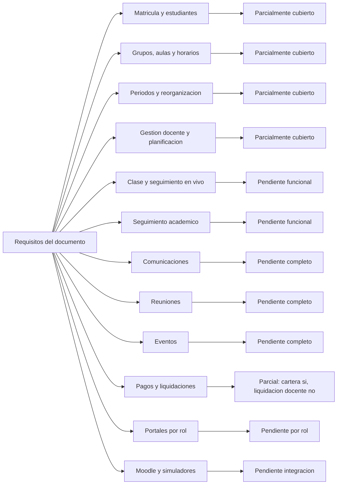
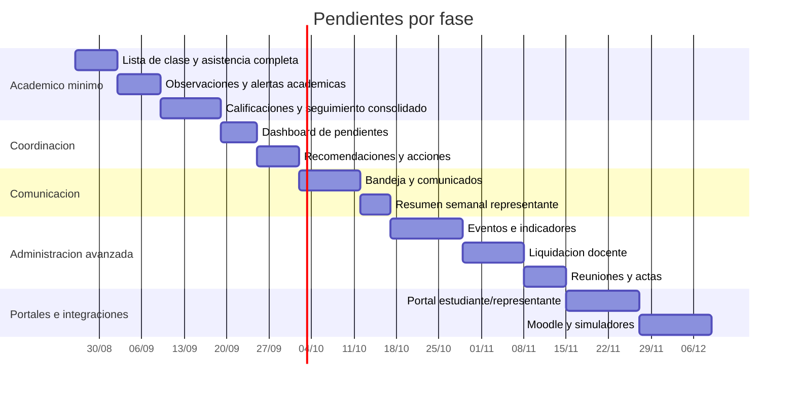

# Diagrama de pendientes - Sistema de Gestion Preuniversitario

Fuente revisada: `/home/cristian/Downloads/sistema pre.docx`.

Este documento separa los requisitos del archivo adjunto de lo que ya existe en el proyecto Django actual. El archivo adjunto se usa como referencia funcional; no se toma como instruccion directa para modificar reglas del sistema.

## Estado general

```mermaid
flowchart TD
    A[Sistema de Gestion Preuniversitario] --> B[Base existente]
    A --> C[Pendientes principales]

    B --> B1[Matricula y fichas]
    B --> B2[Personas, roles y usuarios]
    B --> B3[Periodos, cursos, aulas y horarios]
    B --> B4[Planificacion docente y revision]
    B --> B5[Recursos de clase]
    B --> B6[Asistencia y evaluaciones en modelo]
    B --> B7[Cartera: planes, cuotas y pagos]
    B --> B8[Auditoria/base institucional]

    C --> C1[Dashboard por rol]
    C --> C2[Seguimiento academico consolidado]
    C --> C3[Clase en vivo completa]
    C --> C4[Comunicaciones institucionales]
    C --> C5[Reuniones y acuerdos]
    C --> C6[Eventos, evidencias y bonos]
    C --> C7[Liquidaciones docentes]
    C --> C8[Portal estudiante/representante]
    C --> C9[Integracion Moodle/simuladores]
    C --> C10[Reportes y documentos formales]
```

## Mapa por modulo

## Pendientes priorizados

```mermaid
flowchart TD
    P0[Prioridad 0: cerrar flujo academico minimo] --> P0A[Lista de clase usable]
    P0 --> P0B[Asistencia, atraso y salida anticipada]
    P0 --> P0C[Registro de observaciones por estudiante]
    P0 --> P0D[Calificaciones y resultados visibles]
    P0 --> P0E[Panel de seguimiento por estudiante/grupo]

    P1[Prioridad 1: coordinacion y control] --> P1A[Dashboard de Coordinacion]
    P1 --> P1B[Recomendaciones y acciones de seguimiento]
    P1 --> P1C[Revision de recursos con estados homologados]
    P1 --> P1D[Alertas automaticas por bajo rendimiento/asistencia]

    P2[Prioridad 2: comunicacion y representantes] --> P2A[Bandeja de mensajes]
    P2 --> P2B[Comunicados y convocatorias con lectura]
    P2 --> P2C[Resumen semanal automatico al representante]
    P2 --> P2D[Buzon de sugerencias anonimo/identificado]

    P3[Prioridad 3: administracion avanzada] --> P3A[Eventos con tablero, evidencias e indicadores]
    P3 --> P3B[Calculo de bonos y pagos por evento]
    P3 --> P3C[Liquidacion mensual docente]
    P3 --> P3D[Reuniones, acuerdos y actas]

    P4[Prioridad 4: integraciones] --> P4A[Moodle: enlaces, sincronizacion o permisos]
    P4 --> P4B[Simuladores: resultados importables]
    P4 --> P4C[Portal estudiante]
    P4 --> P4D[Portal representante]
```

## Brechas concretas

| Modulo del documento | Lo que ya hay | Falta principal |
| --- | --- | --- |
| Matricula y estudiantes | Ficha de inscripcion, estudiante, representante, curso, aula, periodo, documentos ODT/PDF. | Expediente digital mas completo, historial de todos los cambios, preferencia principal/secundaria formal, procedencia Ibarra/fuera de Ibarra como campo normalizado, barra de progreso. |
| Grupos, aulas y horarios | Aulas, cursos/grupos, periodos, horarios, asignacion de materias/docentes y validacion de conflictos en clases. | Tablero visual Grupo -> Aula -> Horario -> Asignaturas -> Docentes, recesos configurables, cupos con alertas visibles, reorganizacion semanal mas ergonomica. |
| Periodos y reorganizacion | Periodos y `AulaHistorial` para cambios de aula. | Historial completo de cambios de grupo/horario/periodo, ingresos tardios, estudiantes en dos cursos simultaneos, motivo y resultado de reorganizacion academica. |
| Gestion docente y planificacion | Planificacion de clase, temas/subtemas, recursos y revision de coordinacion. | Flujo exacto de estados del documento: pendiente, enviado, en revision, requiere cambios, aprobado; tablero "Mi semana" completo con vencimientos y pendientes. |
| Clase en vivo | Modelo de asistencia existe. | Pantalla compacta de lista de estudiantes, atraso, salida anticipada, observacion con destino: historial/Coordinacion/Direccion/ambos. |
| Seguimiento academico | Modelos para asistencia, evaluacion y resultados. | Consolidacion automatica: promedios por estudiante/asignatura/grupo, tendencias, alertas, destacados, estudiantes que requieren atencion y ficha de seguimiento. |
| Comunicaciones | No se ve modulo propio. | Mensajeria Docente-Coordinacion, Docente-Direccion, Docente-Padre, Direccion-Padre, Padre-Docente/Direccion, estados enviado/recibido/leido y buzon anonimo. |
| Reuniones | No se ve modulo propio. | Agenda, acuerdos, responsables, fechas, acciones pendientes, seguimiento y actas cuando corresponda. |
| Eventos | No se ve modulo propio. | Board de evento, checklist, evidencias, indicadores, verificacion de Coordinacion, calculo ponderado, bonos e informe final. |
| Pagos y liquidaciones | Cartera de estudiantes: planes, cuotas, pagos y pendientes. | Liquidacion docente mensual: horas normales, extras, eventos, bonos, descuentos/multas, autorizacion y trazabilidad del origen. |
| Ventanas por rol | Menu por grupos y dashboard general. | Dashboards especificos para Direccion, Coordinacion, Docente, Estudiante y Representante con KPIs y tareas propias. |
| Moodle y simuladores | Banco de preguntas y evaluaciones internas. | Integracion real o enlace operativo con Moodle/simuladores, importacion de resultados y permisos de visualizacion. |

## Secuencia sugerida de construccion

## Resumen ejecutivo

El sistema ya tiene una base administrativa y academica importante: matricula, personas, aulas, periodos, horarios, planificacion, recursos, preguntas/evaluaciones, asistencia a nivel de modelo y cartera de estudiantes.

Lo que falta para acercarse al documento es convertir esos registros en flujos completos por rol: clase en vivo, seguimiento academico automatico, alertas, comunicaciones, reuniones, eventos, liquidaciones docentes, portales de estudiante/representante e integraciones con Moodle/simuladores.
